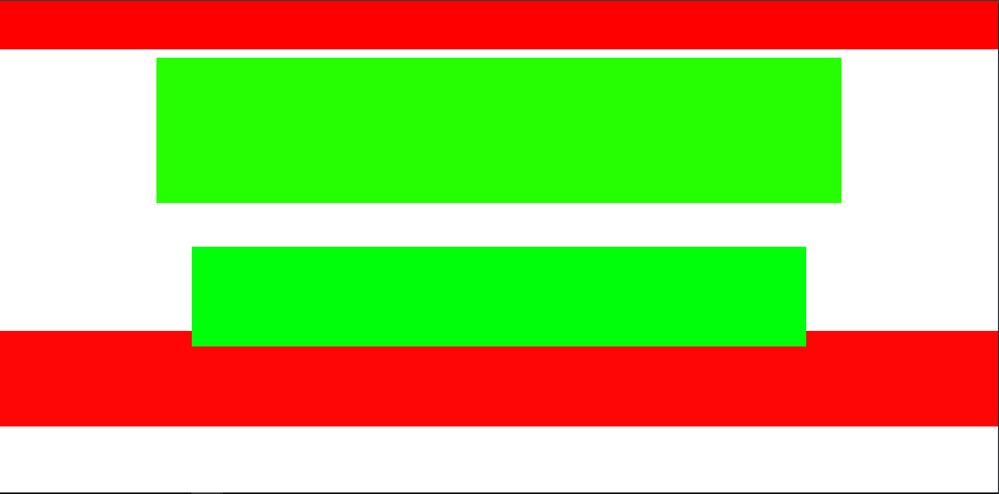
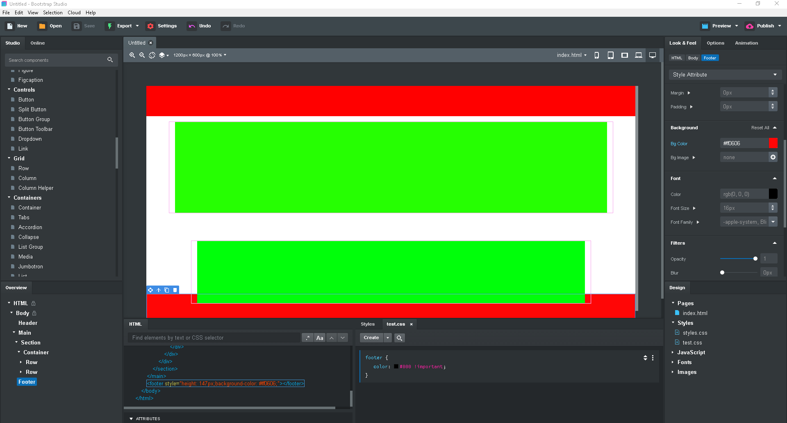

# React Web Application Prototyping with Bootstrap Studio

This is a test case of prototyping a React Web Application with Bootstrap Studio.

https://bootstrapstudio.io/

For this use case, an User Interface is designed based on Bootstrap Responsive Design Methodology and then created on Boostrap Studio. The Design is exported into HTML Templates, and converted into ReactJS Components. These ReactJS Components are added to a ReactJS Application and hosted onto Github Pages.

This application is a Developed Prototype of the User Interface Design.

The original HTML/CSS/JS and Boostrap studio file (.bsdesign) are located in the:

	/test

The React Application is located in the:

	/my-app

## Design of Interface

Inititally the Design should be done using Design Software.

In this case a very simple layout.

## Bootstrap Studio

Now Create the Template on Boostrap Studio with the correct methodology for the placement of the assets on the designs.

Now we will be able to export the HTML Templated Code.

This is an example of the exported code

	<header style="background-color: #ff0000;height: 74px;"></header>
	<main style="background-color: #ffffff;height: 421px;">
		<section>
			

				

					

						

					

				

				

					

						

					

				

			

		</section>
	</main>
	<footer style="height: 147px;background-color: #ff0606;"></footer>

## Create React Application

To create a Basic React Application, we will be using the command line and tools for React.

The development environment is a Windows 10 WSL Ubuntu 18.04 LTS.

Install React using the Facebook's CLI and then serve using npm or yarn.

## Converting HTML to React

### Initial Conversion

Use this tool to convert easily with data-components

https://roman01la.github.io/html-to-react-components/

    <header style="background-color: #ff0000;height: 74px;" data-component="header"></header>
    <main style="background-color: #ffffff;height: 421px;" data-component="main">
        <section data-component="test">
            

                

                    

                        

                    

                

                

                    

                        

                    

                

            

        </section>
    </main>
    <footer style="height: 147px;background-color: #ff0606;"></footer>

### Importing Components and Assets

Create a Component dir in the src dir, and start making each component into it's own seperate dir.

	/components
		/footer
		/header
		/main
		/test

Import Components in App.js

	import Header from './components/header/header'
	import Main from './components/main/main'
	import Footer from './components/footer/footer'

Add to App Render

	class App extends React.Component {
	render() {
		return (
		

			<Header/>
			<Main/>
			<Footer/>
		

		);
	}
	}

### Component to React.Component

May need to change 

	class App extends Component {

To

	class App extends React.Component {

in App.js

### Component in Component

Remember to correctly convert components 

	import test from "../test/test";

to

	import Test from "../test/test";

and

	class main extends React.Component {
	render() {
		return (
		<main
			style={{
			backgroundColor: "#ffffff",
			height: "421px"
			}}
		>
			<test></test>
		</main>
		);
	}
	}

to

	class main extends React.Component {
	render() {
		return (
		<main
			style={{
			backgroundColor: "#ffffff",
			height: "421px"
			}}
		>
			<Test></Test> <----------
		</main>
		);
	}
	}

### Custom CSS and Assets

If there is custom CSS and/or other Assets add them into an assets dir in the src dir.

## React-Bootstrap

The quickest way to move the site from Boostrap Studio to the React Application, is to load the Boostrap CSS and JavaScript files into an assets dir, then to reference them in the HTML.

This could be a good stopping point depending on what type of prototype is being built.

In this case, we will install React-Bootstrap which is the dependency for React.

	https://react-bootstrap.github.io/

Install with npm.

	npm install react-bootstrap bootstrap

Then add the stylesheet

	import 'bootstrap/dist/css/bootstrap.min.css';

into the App.js file

Add this into the index.html

	<link
		rel="stylesheet"
		href="https://maxcdn.bootstrapcdn.com/bootstrap/4.3.1/css/bootstrap.min.css"
		integrity="sha384-ggOyR0iXCbMQv3Xipma34MD+dH/1fQ784/j6cY/iJTQUOhcWr7x9JvoRxT2MZw1T"
		crossorigin="anonymous"
	/>

Look at Docs if there are problems.

## Final HTML BS to REACT BS Conversion

### Swap className to React-Bootstrap Tags

For example

A container would be converted to

	

This is because the ReactJS Conversion is for React using Boostrap Externally.

If we use React-Bootstrap we need to manually change everything to it corresponding JSX Tag

	<Container></Container>

Need to Import 

	import Container from 'react-bootstrap/Container';

Example:
	class test extends React.Component {
	render() {
		return (
		<section>
			<Container>
			<Row className="top">
				<Col>
				

				</Col>
			</Row>
			<Row className="bottom">
				<Col>
				

				</Col>
			</Row>
			</Container>
		</section>
		);
	}
	}

	export default test;

### Component CSS

Create and link a CSS file to each React Component

	import './test.css';

Then move any inline styling in the HTML to the CSS file.

	.top{
		margin: 13px;
	}

	.bottom{
		margin: 67px;
	}

	.div0{
		background-color: #26ff02;
		height: 224px;
	}

	.div1{
		background-color: #00ff0a;
		height: 154px;
	}

## Github Pages

Now we can push it to Github Pages and view it live:

Install gh-pages

	npm install gh-pages

Add homepage line in package.json

	"homepage": "https://jaemnkm.com/React-Web-Application-Prototyping-with-Bootstrap-Studio",

Add these lines in scripts

	"predeploy": "npm run build",
	"deploy": "gh-pages -d build",

Run

	npm run deploy

# Conclusion

Designing User Interfaces using this method, allows for Designs that have real life application based on Industry Standards, as well as development of a User Interface Design Prototype built using sophisticated and UpToDate technologies.

# Live Site

https://jaemnkm.com/React-Web-Application-Prototyping-with-Bootstrap-Studio
